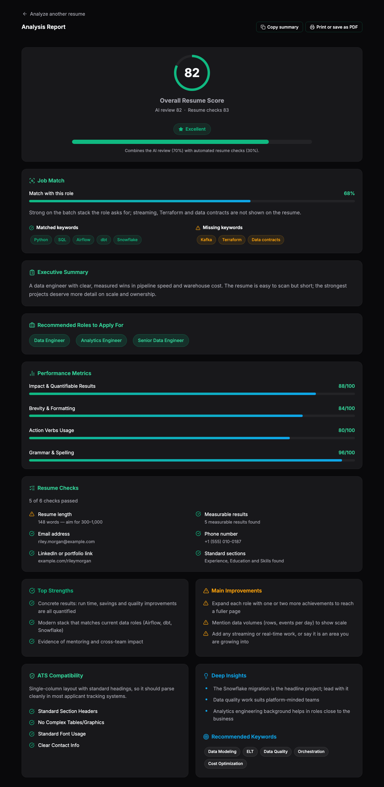
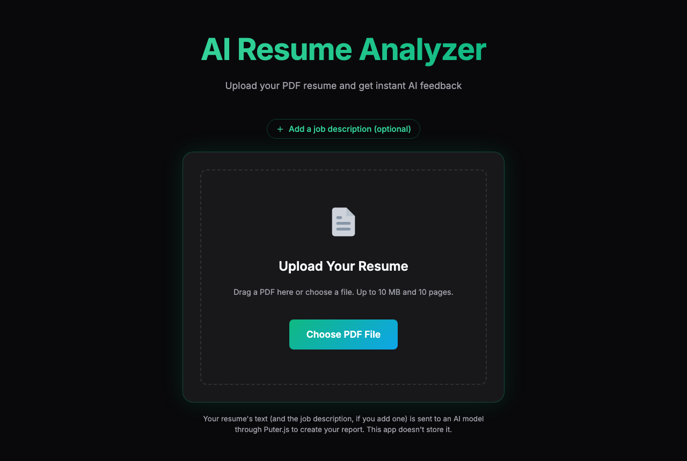
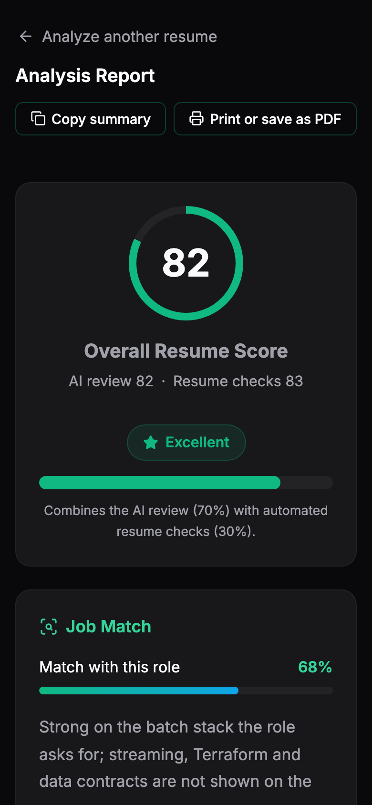

# AI Resume Analyzer

🔗 [Live Demo](https://ai-resume-analyzer-rajcodes.vercel.app/)

A client-side React app that analyzes a PDF resume with AI and turns the result into a scored report: overall score, strengths, improvements, ATS checklist, performance metrics, keyword and role suggestions. There is no backend server; the PDF is read in the browser and the AI call goes through [Puter.js](https://puter.com).



| Upload | Mobile |
|---|---|
|  |  |

## ✨ Features

- **Drag-and-drop or pick a file**: drop a PDF onto the upload area or choose one with the button (keyboard accessible).
- **In-browser PDF parsing**: text is extracted with Mozilla's `pdfjs-dist` in a Web Worker, so the UI stays responsive. The PDF library is loaded on demand, keeping the first page load small.
- **Structured AI analysis**: the AI is asked for strict JSON, and every response is validated and normalized before rendering (scores clamped to 0–100, malformed fields dropped), so a bad response shows an error instead of a broken dashboard.
- **Job description match (optional)**: paste a job posting to get a match score, a short fit summary, and the keywords the resume already covers or is missing.
- **Blended, more stable score**: the overall score combines the AI review (70%) with six automated checks computed in code (30%): length, measurable results, email, phone, LinkedIn/portfolio link and standard sections.
- **Pinned AI model**: every analysis uses the same model (`claude-sonnet-5-5` via Puter.js), and an unreadable AI reply is retried once automatically.
- **Analytics dashboard**: overall score, job match, executive summary, recommended roles, performance metrics, resume checks, strengths, improvements, ATS checklist, insights and keywords.
- **Share the result**: copy a plain-text summary of the report, or print it / save it as a PDF with a clean, light print layout.
- **Accessible**: step-by-step progress announced to screen readers, focus moved to the report when it opens, visible keyboard focus everywhere, and reduced motion respected.
- **Clear error handling**: separate messages for wrong file type, oversized files, too many pages, password-protected PDFs, image-only PDFs, PDFs that take too long to read, a too-short job description, AI timeouts, Puter sign-in or usage-limit problems and unreadable AI responses, plus error boundaries so a rendering failure never blanks the page.

## 🔒 Privacy

- The PDF file itself never leaves your browser; only its **extracted text** is sent for analysis.
- That text — including any name, email or phone number in your resume — **is sent to an AI model via Puter.js**, a third-party service, together with the job description if you add one. Remove details you don't want to share before uploading.
- This app keeps no database, no analytics and no saved reports. (Puter.js may keep its own sign-in data in your browser.)
- The first analysis may open a Puter sign-in window. See [Puter's documentation](https://docs.puter.com) for how its AI usage works.

## 🛡️ Security

- `vercel.json` sends security headers on every response: `X-Content-Type-Options`, `Referrer-Policy`, `Permissions-Policy`, `X-Frame-Options: DENY` and a Content-Security-Policy that blocks framing, `<object>`, base-URL changes and cross-site form posts. Script and connection rules are left open on purpose so Puter.js and its sign-in window keep working.
- `pdfjs-dist` is kept at 6.2.108 or newer ([GHSA-hq66-cqwq-w95j](https://github.com/advisories/GHSA-hq66-cqwq-w95j)).
- Text inside the resume or job description can't break out of its prompt section (delimiter tags are stripped).

## 📏 Limits

| Limit | Value |
|---|---|
| File type | PDF with selectable text (scanned images are not supported) |
| File size | 10 MB |
| Pages | 10 |
| PDF reading time | 30 seconds |
| Text analyzed | First 15,000 characters (the report notes when text was cut) |
| Job description | Optional; 100 to 5,000 characters |
| AI timeout | 2 minutes |

## 🛠 Tech Stack

- **Framework**: React 19 + Vite
- **Styling**: Plain CSS with custom properties
- **PDF parsing**: `pdfjs-dist`
- **AI**: Puter.js
- **Icons**: `lucide-react`

## 🚀 Getting Started

Requires Node.js 22.13 or newer.

```bash
git clone https://github.com/Ra-jj/AI-Resume-Analyzer.git
cd AI-Resume-Analyzer
npm install
npm run dev
```

Then open http://localhost:5173.

| Command | What it does |
|---|---|
| `npm run dev` | Start the dev server |
| `npm run build` | Production build into `dist/` |
| `npm run preview` | Serve the production build locally |
| `npm run lint` | Run ESLint |
| `npm test` | Run the unit tests (Vitest) |
| `npm run test:watch` | Run the unit tests in watch mode |
| `npm run test:e2e` | Run the end-to-end tests (Playwright; run `npx playwright install chromium` once first) |

## 🧪 Testing

- **Unit tests**: about 665 Vitest tests next to the modules they cover (`src/**/*.test.js`), for response normalization, AI error mapping, resume checks, score blending, prompt building and the Puter call (with a stubbed `puter`).
- **End-to-end tests**: 89 Playwright tests drive a fresh production build in Chromium with real PDFs and a stubbed AI: uploads, drag-and-drop, the job description flow, score ratings, almost every error message (all but unreadable-file and unexpected-crash), keyboard access, focus and screen-reader announcements, reduced motion, copy and print, security headers and phone-width layout. No test ever contacts Puter or any other outside site.
- **CI**: every push to `main` and every pull request runs install, lint, unit tests, build and end-to-end tests in GitHub Actions.

## 🗺️ Known follow-ups

- Add a `<main>` landmark and tidy the report's heading levels (h1 → h3 jump).
- Move focus to the error message after a failed analysis.
- Join pdf.js text fragments more carefully so long links aren't split in the Resume Checks details.

## 💡 How It Works

1. **Upload**: the file is checked for type and size before anything else runs.
2. **Parse**: pdf.js extracts the text from each page in a Web Worker.
3. **Analyze**: the text (and the job description, if given) is sent to the pinned AI model with a prompt that requires a fixed JSON structure, while automated checks run on the full text in the browser.
4. **Validate**: the response is parsed and normalized into a guaranteed shape.
5. **Report**: the AI score and check score are blended, and the dashboard renders the result.

## 📁 Project Structure

```
src/
├── App.jsx                     # Switches between the upload and report screens
├── main.jsx                    # Entry point, top-level error boundary, stray-drop guard
├── index.css                   # All styles and design tokens
├── hooks/
│   └── useResumeAnalysis.js    # Upload-flow state: validate → extract → analyze
├── services/
│   ├── pdf.js                  # Lazy-loaded pdf.js text extraction
│   └── analyze.js              # Puter.js AI call and response handling
├── components/
│   ├── UploadView.jsx          # Upload screen with drag-and-drop
│   ├── JobDescriptionInput.jsx # Optional job description field
│   ├── AnalysisProgress.jsx    # Step-by-step loading indicator
│   ├── DashboardView.jsx       # Analysis report
│   └── ErrorBoundary.jsx       # Fallback UI for rendering failures
└── lib/                        # Pure helpers (no React, no network)
    ├── analysis.js             # JSON extraction and response normalization
    ├── resumeChecks.js         # Automated resume checks computed in code
    ├── report.js               # Blends AI and check scores; score ratings
    ├── reportText.js           # Plain-text report summary for copying
    ├── aiErrors.js             # Maps Puter failures to error codes
    ├── prompt.js               # Builds the AI messages and strips injected delimiter tags
    ├── errors.js               # Error codes and user-facing messages
    ├── files.js                # File type/size checks
    └── limits.js               # Limits, timeouts and text helpers
```
